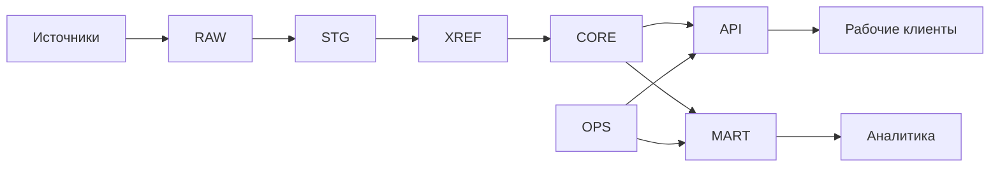

# department-data-core

Архитектура единого ядра структурированных данных на PostgreSQL для среды, где рабочая информация поступает из Excel, CSV, учетных систем, API и других источников.

[Документация](docs/README.md) · [Архитектура](docs/data-core-architecture-standard.md) · [Модель данных](docs/data-modeling-standard.md) · [Подключение источников](docs/registry-integration-standard.md)

## Основа

- PostgreSQL хранит общее состояние и каноническую модель данных.
- Структура источника не определяет структуру `core`.
- Внешние идентификаторы сопоставляются с внутренними через `xref`.
- Рабочие клиенты используют `api`, аналитические — `mart`.
- Общая бизнес-логика не размножается по клиентским файлам.
- Структура базы и серверный SQL-код изменяются через версионированные миграции.

## Документация

Полная карта и порядок чтения: **[`docs/README.md`](docs/README.md)**.

Основные документы:

- [Видение и границы](docs/vision-and-scope.md)
- [Архитектура ядра](docs/data-core-architecture-standard.md)
- [Моделирование данных](docs/data-modeling-standard.md)
- [Подключение новых наборов данных](docs/registry-integration-standard.md)
- [Клиентский API](docs/client-api-standard.md)
- [Аналитическая модель](docs/analytics-standard.md)
- [Production baseline](docs/production-baseline.md)

## Статус

Архитектура v1 зафиксирована. Репозиторий пока содержит архитектурную документацию; реализация будет добавляться поверх согласованных границ.

## Публичность

В репозиторий не размещаются производственные данные, персональные данные, внутренние адреса серверов, сетевые пути, учетные данные и другие закрытые сведения. Примеры должны быть синтетическими или обезличенными.

Документация ведется на русском языке. Имена файлов, каталогов, SQL-объектов и технических идентификаторов — на английском.

## Лицензия

[MIT](LICENSE)
