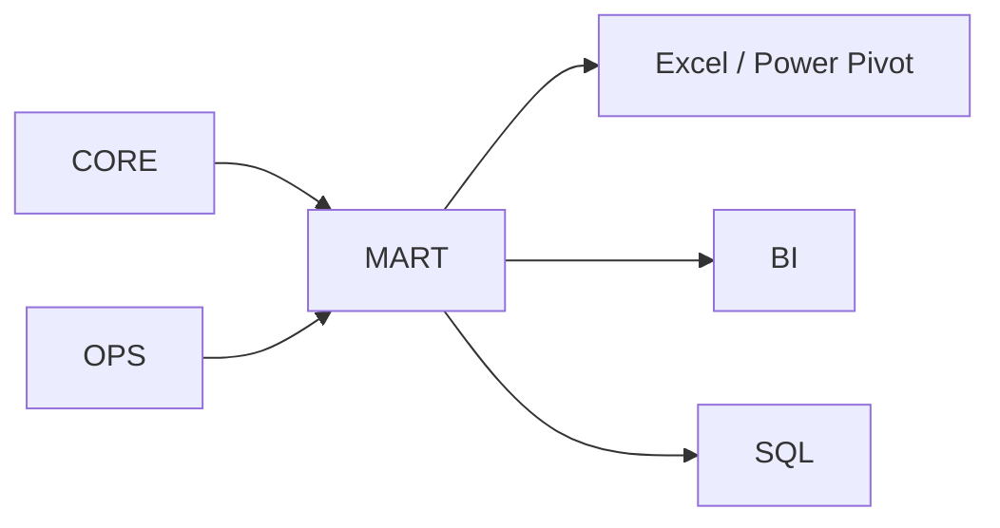
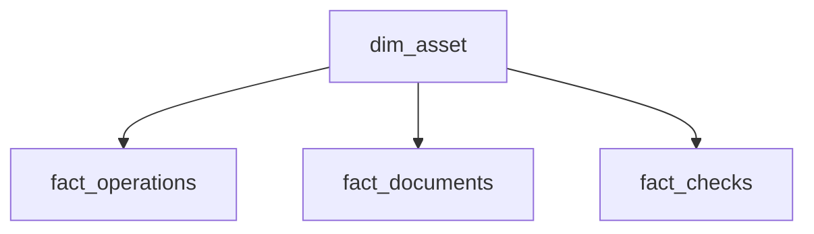

[Главная](../README.md) · [Документация](README.md)

# Стандарт аналитической модели

## 1. Назначение MART

`mart` отделяет аналитическую форму данных от операционной модели `core`.

`core` хранит сущности и бизнес-факты, `ops` — рабочее состояние. `mart` подготавливает эти данные для отчетов и анализа.



Витрина должна быть воспроизводима из ядра. Исправление данных непосредственно в `mart` не используется как способ исправления первичной модели.

## 2. Факты и измерения

Аналитическая модель строится из фактов и измерений.

Факт имеет заранее определенную зернистость:

```text
mart.fact_operation
одна строка = одна операция
```

Измерение задает общий разрез анализа:

```text
mart.dim_date
mart.dim_asset
mart.dim_organization
mart.dim_department
mart.dim_person
```

Если разные факты относятся к одной и той же сущности `core`, они по возможности используют одно общее измерение.



Именно общие измерения дают перекрестный анализ. Связывать факты по совпадению отображаемых названий не следует.

Совместный анализ независимых фактов разных зернистостей не должен перемножать исходные количества. Например, прямое соединение двух участников документа с тремя заправками дает шесть строк и может исказить сумму заправок. Соединение или предварительная агрегация должны соответствовать зернистости фактов и аналитической задаче.

## 3. Даты и история

Для регулярной отчетности используется единое календарное измерение. Факт может иметь несколько ссылок на дату, если у него несколько самостоятельных временных признаков.

Исторический контекст предметных объектов берется из `core`. Если объект менял подразделение, аналитика за прошлый период должна использовать принадлежность, действовавшую в тот период, а не текущее значение.

`mart` не создает историю, которой нет в исходной модели.

## 4. Показатели

Показатель, используемый несколькими отчетами, имеет единое централизованное определение.

К таким показателям могут относиться количество операций, документов, ошибок, объем или продолжительность. Их базовый состав и правила отбора не должны независимо определяться в нескольких Excel-файлах.

В Power Pivot и других клиентах остаются меры представления: доли, сравнения периодов, проценты от итогов и другие вычисления, зависящие от контекста конкретного отчета.

Даже если процент вычисляется в Power Pivot или BI, числитель, знаменатель, единицы и правила исключения для общего бизнес-показателя должны одинаково трактоваться во всех отчетах.

## 5. Форма витрин

В `mart` допустимы:

- детальные fact-таблицы;
- широкие представления для удобства клиента;
- агрегаты;
- материализованные представления.

Денормализация в `mart` допустима и не является основанием переносить ту же структуру в `core`.

Агрегат или материализованное представление создается под реальную задачу производительности или удобства, а не заранее.

Не следует строить универсальную витрину с сотнями полей «на все случаи». Несколько фактов с общей системой измерений лучше сохраняют смысл и пригодность для перекрестного анализа.

## 6. Граница аналитического клиента

Типичный Excel-клиент получает подготовленные данные из `mart` через Power Query, строит модель Power Pivot и визуализацию.

```text
PostgreSQL MART
      ↓
Power Query
      ↓
Power Pivot
      ↓
Отчет
```

Power Query в аналитическом файле не должен повторять интеграционный ETL ядра или заново сопоставлять сущности из разных источников.

Рабочие действия пользователей также не записываются в `mart`; для этого существует рабочий API и `ops`.

## 7. Проверка новой витрины

Перед созданием аналитического объекта должны быть определены:

1. аналитическая задача;
2. зернистость;
3. источник фактов в `core` или `ops`;
4. общие измерения, которые можно переиспользовать;
5. показатели, требующие общего определения;
6. необходимость денормализации или агрегации.

Витрина считается частью корректной модели, если ее можно пересобрать из ядра и она не создает параллельный источник истины.
