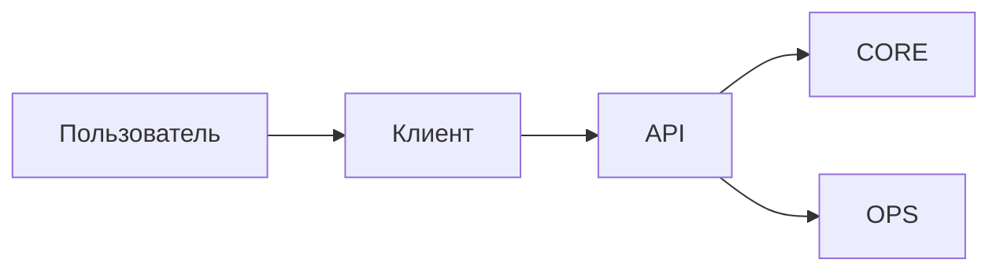

[Главная](../README.md) · [Документация](README.md)

# Стандарт клиентского API

## 1. Граница клиента

Рабочие приложения обращаются к ядру через схему `api`. Они не работают напрямую с таблицами `core`, `ops`, `xref` и другими внутренними структурами.



API скрывает физическую модель и предоставляет завершенные операции: получить рабочую выборку, найти запись, получить счетчики, сохранить результат, назначить исполнителя.

Аналитические клиенты используют `mart`, а не рабочий API.

## 2. Ответственность клиента

Клиент отвечает за интерфейс:

- ввод параметров и фильтров;
- отображение результата;
- простую проверку пользовательского ввода;
- вызов серверной операции;
- обработку ее результата.

На клиент не выносятся правила сопоставления сущностей, глобальные очереди и счетчики, дедупликация всей базы, конкурентная логика и контроль целостности.

Для Excel это означает тонкий слой VBA между листом и PostgreSQL: прочитать параметры, вызвать API, получить набор, вывести его в таблицу; для записи — передать идентификатор и действие пользователя и обработать ответ.

## 3. Контракт операций

Операция API должна решать одну законченную задачу. Ее контракт определяет параметры, типы и смысл входа и результата, допустимость `NULL`, ожидаемые отказы, побочный эффект, ограничения объема результата и единицу атомарности.

Публичный результат задается явно. Физическая строка внутренней таблицы не становится контрактом API автоматически.

Примеры:

```text
api.get_queue(...)
api.save_check(...)
```

Для чтения могут использоваться функции и представления. Для изменения состояния предпочтительна серверная функция или процедура, выполняющая операцию атомарно.

Клиент передает параметры. Пользовательский ввод не вставляется в SQL конкатенацией строк.

## 4. Выборки

Фильтрация больших наборов выполняется в PostgreSQL. Клиент получает только данные, необходимые для текущей работы.

Рабочая очередь строится из актуального состояния `core` и `ops`, а не хранится отдельным пользовательским файлом. Общие счетчики также рассчитываются сервером.

Локальная сортировка небольшой уже полученной выборки допустима как часть интерфейса. Загрузка всего массива данных ради последующей фильтрации в Excel — нет.

## 5. Запись

Серверная операция записи должна сама проверить текущее состояние и ограничения, выполнить связанные изменения и вернуть результат.

Системные поля времени (`created_at`, `updated_at`, `checked_at` и подобные) задаются сервером, если они фиксируют момент записи в системе. Бизнес-время передается клиентом только тогда, когда является частью вводимого события.

Если процесс требует учета исполнителя, API использует устойчивый идентификатор пользователя или рабочей роли. Отображаемое имя не используется как ключ. Автор действия и его полномочия определяются или проверяются сервером через доверенный контекст. Переданные клиентом `user_id`, имя или самостоятельно установленный параметр сессии сами по себе не подтверждают личность и полномочия.

## 6. Конкурентная работа и ошибки

Несколько клиентов работают с одним состоянием PostgreSQL. Файловые блокировки и локальные механизмы синхронизации общей базы не используются.

Получение записи для просмотра не означает ее назначения. Исключительное получение в работу или назначение выполняется атомарной серверной операцией: успешно завершается только допустимое процессом число конкурирующих действий, остальные получают определенный конфликт. При записи устаревшего состояния сервер не должен молча затирать более новое изменение; условие записи и результат конфликта задаются контрактом.

Если сервер мог зафиксировать изменение, а клиент потерял ответ, операция должна допускать безопасный повтор или получение результата ранее выполненного действия. Неизвестный клиенту исход не считается доказанным откатом. Неделимая операция не разрывается промежуточными фиксациями, а транзакция не удерживается на время пользовательского ввода.

Целостность обеспечивается транзакциями, ограничениями и средствами PostgreSQL. Клиент получает итог операции и показывает пользователю понятное сообщение. Техническая ошибка SQL может журналироваться, но не должна становиться пользовательским интерфейсом.

## 7. Права

Рабочему клиенту выдаются минимальные права на предусмотренные объекты `api`. Он не получает прямых прав на изменение внутренних таблиц `core` и `ops` или структуры базы.

Серверная операция может выполнять изменения от имени ограниченной серверной роли. Один из допустимых механизмов PostgreSQL — `SECURITY DEFINER`. При его использовании требуются минимальные права владельца, безопасный `search_path`, исключающий подмену объектов вызывающим, и явные права `EXECUTE` без избыточного доступа через `PUBLIC`.

Клиентская валидация нужна для удобства пользователя, но не заменяет ограничения PostgreSQL.

## 8. Совместимость

Внутренние изменения `core` и `ops` не должны затрагивать клиент, пока сохраняется контракт используемой операции API.

Действующие контракты сохраняются. Несовместимое изменение оформляется новой операцией либо согласованной миграцией клиентов.

Смена транспорта вызова, в том числе появление HTTP-адаптера поверх SQL API, не меняет семантику операции.

## 9. Проверка новой операции

Перед добавлением операции проверяется:

1. выполняет ли она одну законченную задачу;
2. определены ли типы и смысл параметров;
3. ограничен ли возвращаемый объем данных;
4. выполняются ли основная фильтрация и проверки на сервере;
5. атомарна ли запись там, где это требуется;
6. не вынесена ли общая бизнес-логика в клиент;
7. не требует ли клиент знания внутренних JOIN и таблиц ядра.
