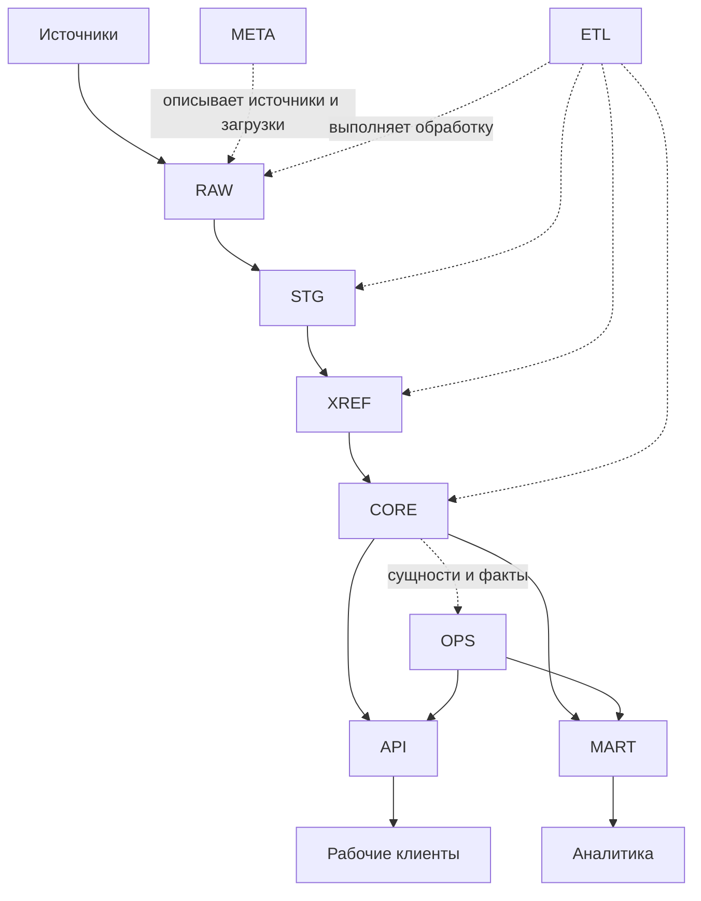

[Главная](../README.md) · [Документация](README.md)

# Стандарт архитектуры единого ядра данных

## 1. Каркас

Ядро реализуется в одной логической базе PostgreSQL. Схемы разделяют этапы обработки, каноническую модель, рабочее состояние и способы доступа.



Схемы:

```text
meta
raw
stg
xref
core
ops
etl
api
mart
```

`etl` содержит функции и процедуры. Это кодовый контур, а не дополнительная копия данных.

## 2. Ответственность схем

| Схема | Хранит или предоставляет | Не должна делать |
|---|---|---|
| `meta` | источники, наборы данных, загрузки и их состояние | дублировать бизнес-данные |
| `raw` | данные, полученные от конкретного набора данных | объединять разные источники в общую модель |
| `stg` | типизированные и технически нормализованные данные источника | решать задачи канонической бизнес-модели |
| `xref` | соответствие внешних ключей внутренним ID | хранить независимую копию сущности |
| `core` | сущности, бизнес-факты и их отношения | повторять структуру файла или пользовательского экрана |
| `ops` | рабочие статусы, проверки, назначения и действия | менять смысл бизнес-фактов `core` |
| `etl` | серверные процедуры преобразования и загрузки | быть пользовательским интерфейсом |
| `api` | стабильные операции рабочих клиентов | раскрывать клиентам внутреннюю физическую модель |
| `mart` | факты, измерения и витрины для анализа | становиться первичным источником истины |

## 3. Путь данных

Данные источника сначала сохраняются в `raw` как полученный вход. В `stg` выполняется техническое приведение формы по входному контракту: типизация, удаление незначимых пробелов, согласование регистра, преобразование строк в даты и числа, нормализация формы идентификаторов и согласованная обработка пустых значений. Нормализация Unicode допустима, если она сохраняет предметный смысл.

Выбор канонического объекта и авторитетного источника, разрешение предметного конфликта, исправление значения по смыслу и общая бизнес-логика не относятся к `stg`. Совпадение значений строк само по себе не доказывает, что это повтор одного предметного факта.

`xref` разрешает внешнюю идентичность, а `core` хранит предметную модель. Путь `STG → XREF → CORE` задает логическую последовательность разрешения смысла и идентичности, а не обязательный порядок SQL INSERT. Объект `core` и его соответствие `xref` могут создаваться согласованно в одной серверной операции и транзакции. `xref` хранит сопоставления идентификаторов, а не весь состав данных `stg`.

Рабочее состояние хранится отдельно в `ops`. Оно связано с объектами и фактами `core`, но не подменяет их.

Клиентские границы также разделены: рабочие приложения используют `api`, аналитические — `mart`.

## 4. META и происхождение

`meta` должна различать как минимум три понятия:

- `source` — логический источник сведений и область его ответственности;
- `dataset` — структурированный набор внутри источника с определенными смыслом и зернистостью;
- `load` — отдельное поступление набора данных.

Один источник может предоставлять несколько наборов. Каждая загрузка должна быть однозначно связана с набором и иметь наблюдаемое состояние.

Транспорт определяет способ доставки и не подменяет идентичность источника или набора. Получение входа и его обработка различаются.

## 5. Архитектурные правила

### A01. Источник не определяет CORE

Таблица, лист или файл источника не превращается автоматически в одноименную таблицу `core`. Сначала определяется смысл данных и их место в модели.

### A02. Одна таблица — одна зернистость

Для любой таблицы должно быть возможно одним предложением определить, что означает одна строка. Смешение независимых уровней детализации не допускается.

### A03. RAW сохраняет происхождение

`raw` сохраняет полученное на границе ядра представление входных данных как свидетельство конкретного поступления, однозначно связанное с загрузкой. Данные разных источников хранятся раздельно до момента их осмысленного сопоставления.

После фиксации входные значения `raw` не переписываются. Исправленная поставка оформляется как новое поступление. Повторная обработка не изменяет первоначальный вход.

Для каждого импортированного результата — факта, принятого состояния сущности или сохраняемой версии — должен существовать прослеживаемый путь к использованным входным записям и обработке, сформировавшей результат. Сохраняются основания решений, которые нельзя восстановить из входа и примененных правил. Постоянное хранение промежуточных результатов `stg` не требуется.

Горизонт воспроизводимости задается явно с учетом срока доступности входа и необходимых оснований решений. `raw` можно архивировать. Удаление единственной копии входа означает потерю возможности полной повторной обработки соответствующего периода.

### A04. Внешние ключи не становятся внутренней идентичностью

Связи внутри ядра используют стабильные внутренние ID. Внешние идентификаторы источников разрешаются через `xref`.

### A05. CORE описывает предметную область

`core` хранит сущности, факты и отношения, которые сохраняют смысл при замене источника или пользовательского приложения.

### A06. Клиент не хранит общую истину

Excel, веб-интерфейс или другое приложение может временно отображать рабочую выборку, но общее состояние хранится в PostgreSQL.

### A07. Структура базы воспроизводима

DDL, функции, представления и права изменяются через версионированные SQL-миграции. Ручное изменение production-базы не заменяет изменение исходного кода проекта.

## 6. Подключение новых данных

Новый набор проходит тот же путь, что и существующие:

```text
META → RAW → STG → XREF → CORE
```

`xref` используется только там, где требуется сопоставление внешней идентичности. `ops`, `api` и `mart` добавляются только при наличии соответствующей рабочей или аналитической задачи.

Перед созданием новой сущности `core` проверяется, не описывает ли набор уже существующую сущность или факт.

## 7. Допустимое развитие

Рост системы обычно выражается в новых источниках, таблицах `raw` и `stg`, правилах сопоставления, сущностях и фактах `core`, операциях `ops`, функциях `api` и витринах `mart`.

Новый архитектурный слой вводится только тогда, когда существующие границы не позволяют выразить самостоятельную ответственность без их нарушения.

Базовый каркас не зависит от количества реестров, пользователей и аналитических отчетов.
