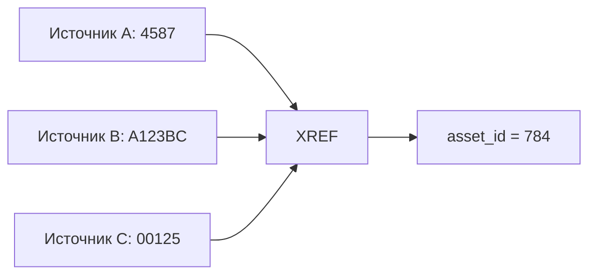

[Главная](../README.md) · [Документация](README.md)

# Стандарт моделирования данных

## 1. Основа модели

Модель `core` строится по предметной области, а не по структуре исходных файлов.

Если строка источника одновременно содержит организацию, подразделение, объект и операцию, это не означает, что все они должны храниться в одной таблице. Сначала выделяются самостоятельные сущности, факты и отношения между ними.

## 2. Зернистость

Перед созданием таблицы фиксируется, что означает одна строка.

Примеры:

```text
core.asset      — один объект
core.operation  — одна операция
ops.check       — один факт проверки
```

Если строка объединяет несколько независимых уровней детализации, таблица спроектирована неверно.

## 3. Сущности, факты и отношения

**Сущность** имеет собственную идентичность: организация, подразделение, объект, человек, место.

**Факт** фиксирует произошедшее событие или состояние: документ, операция, транзакция, событие.

**Отношение** связывает сущности. Связь один-ко-многим задается внешним ключом на стороне множества. Связь многие-ко-многим оформляется отдельной таблицей.

Самостоятельные дочерние факты и структурированные отношения моделируются отдельными типизированными таблицами. Связи не подменяются строковыми списками вида `12,15,18`, массивами, JSON или универсальной EAV-таблицей и не раскладываются по колонкам `item_1`, `item_2`, `item_3`.

Атрибут участия относится к связи, если описывает участие, а не саму сущность. Например, человек — сущность, его участие в документе — отношение, роль «основной» или «стажер» — атрибут этого участия. Ключ отношения учитывает допустимые повторные участия.

Связанные элементы одной операции сохраняют исходную связь в своей естественной зернистости. Например, работа и маршрут не раскладываются в независимые множества, если это теряет соответствие между ними.

## 4. Идентификаторы и ключи

Самостоятельные сущности и факты получают внутренние ID:

```text
asset_id
organization_id
document_id
operation_id
```

Тождество объекта определяется правилами идентификации предметной модели, а внутренний ID закрепляет эту идентичность и используется во внутренних связях. Он не зависит от внешнего номера или источника, сохраняется при повторной загрузке и смене внешнего номера или источника и не переиспользуется для другого предметного объекта.

Идентичность объекта отличается от идентичности версии его сведений. Если версии хранятся отдельно, их идентификаторы не заменяют внутренний ID самого объекта.

Внешние идентификаторы сопоставляются через `xref`:



Полный внешний ключ источника задается вместе с областью уникальности: источником, пространством идентификаторов и необходимыми компонентами — типом объекта, периодом или другими признаками. `dataset` входит в эту область только тогда, когда он действительно ограничивает пространство идентификаторов.

Для полного внешнего ключа допускается не более одного действующего соответствия существующему внутреннему объекту соответствующего типа. Несколько внешних ключей могут вести к одному внутреннему ID. Если источник повторно выдает тот же ключ другому объекту, контракт должен различать такие выдачи.

При неоднозначности произвольное сопоставление не допускается. Если стабильного внешнего ключа нет, контракт явно определяет возможные гарантии распознавания объекта между поступлениями и ограничения связей и повторной обработки. Номер строки загрузки и хеш изменяемых значений сами по себе не обеспечивают устойчивую предметную идентичность.

Ошибочное сопоставление исправляется с сохранением основания и явным пересмотром затронутых ссылок и результатов. Изменение `xref` не должно автоматически переписывать уже сохраненные факты: их исправления оформляются по правилам соответствующей предметной модели.

Бизнес-ключ используется для идентификации и контроля уникальности в предметной области. Он задается вместе с полной областью уникальности и закрепляется соответствующим ограничением базы. Ключ может быть составным, например `(numbering_year, document_number)`; организация и другие компоненты включаются при независимой нумерации в их пределах. Бизнес-ключ не заменяет внутренний ID. Если устойчивого естественного бизнес-ключа нет, искусственный бизнес-ключ не придумывается.

Каждая самостоятельная таблица имеет первичный ключ. Составной первичный ключ допускается для чистой таблицы связи, если самой строке не требуется отдельная идентичность.

## 5. Целостность и значения

Отношения между таблицами закрепляются внешними ключами. Обязательность и допустимые значения задаются ограничениями базы, а не только логикой клиента.

`NULL` означает отсутствие известного значения. Он не используется как синоним нуля, пустой строки, ошибки или специального статуса.

Повторяющиеся значения выносятся в отдельную сущность или справочник только тогда, когда имеют самостоятельный устойчивый смысл. Формальная нормализация ради самой нормализации не требуется.

Производное значение не хранится в `core`, если оно однозначно восстанавливается из исходных фактов и не имеет собственного исторического смысла. Значение, зафиксированное источником или значимое на конкретный момент времени, хранится как факт.

## 6. История

История сохраняется там, где замена текущего значения искажает прошлые периоды.

Например, принадлежность объекта подразделению может храниться как период действия:

```text
core.asset_department
─────────────────────
asset_id
department_id
valid_from
valid_to
```

Для периодов действия определяются границы. Рекомендуемая базовая форма — `[valid_from, valid_to)`: начало включено, конец исключен. Пересечения запрещаются только там, где предметный смысл исключает параллельные периоды. Период действия не подменяется временем загрузки.

Историзация не включается автоматически для каждой таблицы.

Время бизнес-события и время загрузки различаются. `operation_date` описывает предметную область, `loaded_at` — технический момент поступления данных.

## 7. CORE, OPS и MART

`core` хранит сущности и бизнес-факты. Поля, относящиеся к рабочему процессу, выносятся в `ops`.

```text
core.document       — документ
ops.document_check  — результат проверки
```

Статусы вроде `checked`, назначения исполнителя и ошибки проверки не добавляются в сущность `core`, если они описывают работу с ней, а не саму сущность.

`ops` может хранить собственные исторические факты действий. Текущее состояние процесса и отдельное действие имеют разную зернистость; перезаписываемый статус не является полной историей.

Контракт проверки определяет, что проверено: объект, версия или определенный состав данных. Поведение результата проверки после изменения объекта задается правилами конкретного процесса.

`core` также не денормализуется под конкретный отчет. Широкие аналитические представления относятся к `mart`.

## 8. Исправления и удаление

`raw` не изменяется при исправлении данных на следующих слоях.

Исправление бизнес-факта оформляется способом, соответствующим его природе: обновлением текущего состояния, новой версией, корректирующей записью или отдельным статусом. Физическое удаление из `core` не используется как обычный способ исправления истории.

## 9. Именование

SQL-объекты и технические идентификаторы именуются на английском языке и по смыслу:

```text
asset
asset_id
document_date
loaded_at
```

Не используются технические префиксы и временные названия вроде `tbl_asset`, `data1`, `registry_final`, `main_table`.

## 10. Проверка новой таблицы

Перед добавлением таблицы должны быть определены:

1. зернистость;
2. тип объекта — сущность, факт или отношение;
3. место в существующей модели;
4. внутренний ID и бизнес-ключ, если он существует;
5. внешние идентификаторы, требующие сопоставления;
6. связи с существующими сущностями;
7. необходимость хранения истории;
8. граница между `core`, `ops` и `mart`.

Если таблица является прямой копией исходного реестра и ее смысл нельзя сформулировать независимо от этого реестра, она не готова для `core`.
