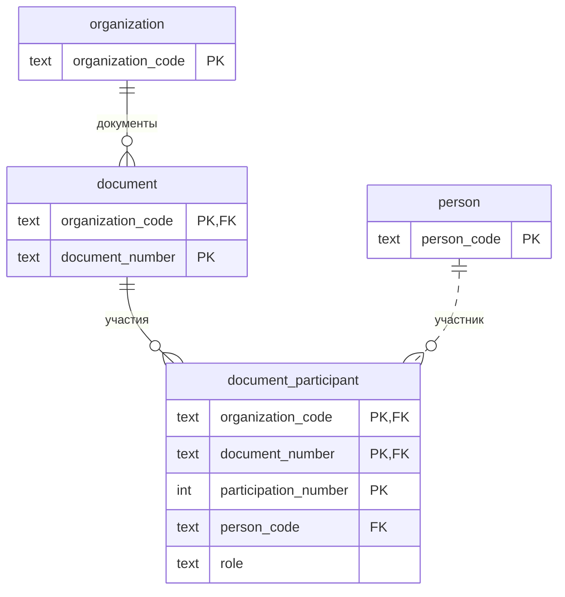

[Главная](../README.md) · [Канон БД](README.md)

# Моделирование данных DDC

Документ описывает смысл строк, ключей и отношений, представление значений и ограничения целостности.

Сила нормативных слов определена в [архитектуре БД](data-core-architecture-standard.md#сила-нормативных-утверждений). Ответственности схем определены только в [A03](data-core-architecture-standard.md#a03-схемы-и-зависимости).

## M01. Модель и зернистость

Модель данных — описание смысла объектов, атрибутов, идентичности, отношений и допустимых состояний данных.

**Сущность** — предметный объект, тождество которого определяется независимо от набора его изменяемых атрибутов.

**Факт** — утверждение о событии или состоянии.

**Отношение** — участие объектов в заданных ролях.

**Зернистость** — смысл одной строки и признаки, различающие строки этого смысла.

**Обязательно:** для каждой таблицы и представления определены зернистость, смысл и типы атрибутов и допустимые значения. Для хранимой таблицы определены ключи и кратность отношений. Строка не совмещает независимые экземпляры разных зернистостей. Определение представления не требует отдельного поля ID или физического PK.

**Обязательно:** сохраняемые данные и элементы модели представляют заявленные данные либо обеспечивают конкретный инвариант модели. Необходимость физических SQL-объектов для реализации доступа или доказанной производительности этим правилом не определяется. Существование шаблона или схемы само по себе не требует технических данных или элементов модели.

## M02. Идентичность и ключи

**Предметная идентичность** — правило, по которому два наблюдения относятся к одному объекту, факту или участию.

**Business key** — ключ из предметных атрибутов с заданной областью уникальности.

**Ключ строки** — значения, различающие строки заданной зернистости.

**PRIMARY KEY (PK)** — выбранный непустой уникальный ключ таблицы.

**Surrogate key** — ключ, добавленный для различения строк и не выводимый из их предметных атрибутов.

**Внутренний идентификатор объекта** — закреплённое в DDC обозначение его тождества; он не обязательно является surrogate key.

**По умолчанию:** постоянная таблица имеет PK, соответствующий идентичности строки. Отказ от PK допустим для полностью воспроизводимого производного представления, если на его строки нет ссылок как на самостоятельные объекты, а объявленная зернистость и уникальность обеспечены его определением и ограничениями.

**Обязательно:** область уникальности business key включает все компоненты независимой нумерации или различения.

**Допустимо:** естественный либо составной PK сущности, факта или отношения. Business key является PK, если он удовлетворяет требованиям ключа строки и отношений модели.

**Допустимо:** surrogate key только при конкретном требовании к идентичности или связям, которое имеющийся предметный ключ не удовлетворяет либо для которого такой ключ отсутствует. Модель определяет это требование и причину, по которой предметный ключ отсутствует или не удовлетворяет ему. Самостоятельность объекта или удобство не являются достаточным основанием для отдельного ID.

**Обязательно:** если модель распознаёт один объект при смене его обозначений, связь с этим объектом сохраняется. Значение идентификатора не переиспользуется для другого объекта в области и времени, в которых модель различает эти объекты.

**Обязательно:** при добавленном surrogate key доказанная предметная уникальность закрепляется отдельно. Новый ID сам по себе не различает повторный вход и новый факт.

**Запрещено:** придумывать дополнительный business key при отсутствии предметного правила идентификации. Адрес входной строки и хеш изменяемых значений не заменяют такое правило.

**Пример:** номер документа уникален внутри организации. Его business key — пара «организация, номер документа». Если по условиям M02 добавлен числовой surrogate key, эта пара по-прежнему определяет предметную уникальность.

## M03. Отношения и структура атрибутов

Простая ссылка связывает строку с другим объектом. Самостоятельное отношение описывает участие и его свойства.

**Обязательно:** ссылка на хранимый объект использует определённый моделью ключ целевого объекта и кратность отношения. Для простой связи один-ко-многим без самостоятельной зернистости отношения FK находится в таблице стороны множества. Отношение с собственными атрибутами, историей, повторным участием или иной самостоятельной зернистостью представлено отдельной таблицей отношения; связь многие-ко-многим также представлена таблицей отношений. Если ограничено участие одного объекта, эта кратность закрепляется соответствующей уникальностью.

**Обязательно:** самостоятельные дочерние факты и участия представлены строками своей зернистости. Атрибут участия принадлежит отношению. Ключ участия различает повторные участия, если они допускаются предметным смыслом.

**Пример:** документ относится к одной организации; это простая связь с FK в `document`. Участия людей имеют собственную нумерацию внутри документа и атрибут `role`, поэтому представлены в `document_participant`. Один человек может участвовать в документе несколько раз.

```mermaid
erDiagram
    organization ||--o{ document : "документы"
    document ||--o{ document_participant : "участия"
    person ||..o{ document_participant : "участник"

    organization {
        text organization_code PK
    }
    document {
        text organization_code PK, FK
        text document_number PK
    }
    person {
        text person_code PK
    }
    document_participant {
        text organization_code PK, FK
        text document_number PK, FK
        int participation_number PK
        text person_code FK
        text role
    }
```

**Запрещено:** разлагать связанные компоненты одного факта на независимые множества, если исчезает соответствие между компонентами. Предметные ссылки и самостоятельные строки не заменяются списком в строке, нумерованными колонками или вложенным значением, скрывающим их идентичность и ограничения.

**Допустимо:** JSON или ARRAY как представление единого атрибута, если модель не требует самостоятельной идентичности и реляционных ссылок его элементов, а заявленные ограничения значения обеспечиваются в БД.

**Допустимо:** EAV — представление «объект, атрибут, значение» — когда сами определения атрибутов и их значения являются предметом модели. Типы, допустимые значения и отношения такой модели задаются явно; EAV не отменяет требования целостности.

**Допустимо:** скалярный атрибут без отдельного справочника. Повторение одинаковых значений не является требованием создать сущность. Отдельная сущность или справочник представляет самостоятельную идентичность, отношения либо явно заданную классификацию.

## M04. Внешняя идентичность

Один объект может иметь разные обозначения в разных источниках. Отдельное сопоставление требуется не во всех моделях.

**Внешняя идентичность** — обозначение объекта в пространстве идентификаторов источника. Полный внешний ключ включает само обозначение и компоненты его области уникальности. **XREF** — сохраняемое соответствие такого ключа выбранному ключу канонического объекта.

**Обязательно:** область внешнего ключа определена. Набор данных входит в неё только при независимой нумерации в этом наборе; повторная выдача обозначения другому объекту различается дополнительным компонентом области или периодом, если это предусмотрено источником.

**Обязательно:** сохраняемое соответствие относится к одному существующему объекту заданного типа. Один полный внешний ключ не обозначает несколько разных объектов в одной области действия. Несколько внешних ключей одного объекта допустимы.

**Допустимо:** модель без `xref`, если внешний ключ является ключом объекта по M02 либо соответствие однозначно выводится из уже хранимых данных.

**Обязательно:** сохранять соответствие в `xref`, если модель требует повторного распознавания внешнего обозначения как того же канонического объекта, а такое соответствие не выводится из уже хранимых ключей и правил. Ключ целевого объекта допускается составным; отдельный внутренний ID не следует из существования `xref`.

**Запрещено:** при неоднозначном соответствии выбирать объект произвольно. Если исходные обозначения не позволяют распознавать объект между поступлениями, модель не заявляет такую гарантию.

**Обязательно:** изменение соответствия не изменяет сохранённые предметные факты без правила их исправления по [M09](#m09-изменение-состояния).

## M05. Значения, единицы и время

`NULL` означает отсутствие значения в смысле конкретного атрибута: неизвестность, неприменимость или иной явно определённый вид отсутствия.

**Обязательно:** значение `NULL` и его допустимость определены для атрибута. Если модель различает несколько видов отсутствия, это различение представлено в данных.

**Запрещено:** подменять `NULL` числовым нулём, пустой строкой, ошибкой или статусом. Ноль и пустая строка сохраняются как значения, если именно такой смысл задан моделью.

**Пример:** в атрибуте расхода с единицей «литр» `0` означает измеренный нулевой расход, а `NULL` — неизвестный расход.

**Обязательно:** смысл количественного значения однозначен; для размерной величины определена единица. При фиксированной единице она задана в определении атрибута; при переменной — определяется данными строки либо её однозначным контекстом. Масштаб и точность определяются, если они являются частью контракта либо необходимы для корректного представления значения. Отдельная колонка единицы и суффикс имени из этого требования не следуют.

**Обязательно:** нормализованный временной атрибут вне исходного представления RAW различает календарную дату, время суток, локальные дату и время, абсолютный момент либо период. Тип соответствует этому смыслу: `date`, `time`, `timestamp without time zone`, `timestamptz` или представление периода соответственно.

**Обязательно:** для абсолютного момента интерпретация входного времени определяет единственный момент. Для локального времени часовой пояс нужен только при требуемом преобразовании в абсолютный момент. `timestamptz` не сохраняет исходное имя часового пояса; его отдельное хранение требуется только как самостоятельный атрибут модели.

**Обязательно:** предметное время события или действия значения не подменяется техническим временем поступления или записи. Наличие одного временного атрибута не требует другого. Если атрибут фиксирует момент операции БД, его значение задаётся в БД по определённой семантике этого момента.

## M06. Ограничения целостности

Целостность проверяется в БД, чтобы результат не зависел от пути записи. Таблица ниже связывает инварианты модели с механизмами PostgreSQL.

**Обязательно:** заявленные уникальность, обязательность, допустимые значения и ссылки на хранимые объекты обеспечиваются средствами PostgreSQL на всех разрешённых путях изменения данных.

| Инвариант | Средство PostgreSQL |
|---|---|
| ключ строки таблицы | PK по M02 |
| дополнительная предметная уникальность | `UNIQUE` или уникальный индекс с областью, соответствующей модели |
| ссылка на ключ хранимого объекта | `FOREIGN KEY (FK)` |
| обязательное значение | `NOT NULL` |
| условие над значениями одной строки | `CHECK`, тип или домен |
| запрещённое сочетание значений разных строк | ограничение исключения либо другое средство, обеспечивающее заявленный инвариант |

**Обязательно:** условия проверок учитывают семантику `NULL`. Обычный `UNIQUE` не запрещает все повторы с `NULL`; `CHECK`, возвращающий `NULL`, не отклоняет строку. Для составной FK допустимость частично пустой ссылки задаётся моделью.

**Запрещено:** использовать `CHECK` с чтением других строк как гарантию межстрочного или межтабличного инварианта.

**Допустимо:** серверный SQL-механизм для условия, не выражаемого декларативным ограничением, если он сохраняет это условие и при конкурентных изменениях. Поведение FK при изменении и удалении целевого ключа соответствует смыслу зависимости; общий `CASCADE` из наличия связи не следует.

**Запрещено:** создавать фиктивный предметный объект только для прохождения обязательной FK. Неразрешённая обязательная ссылка не является допустимым принятым фактом.

## M07. История и периоды

История состояния — данные о разных состояниях одного объекта или отношения. Версия — отдельно различаемое сохранённое состояние этого объекта или отношения.

**По умолчанию:** модель хранит текущее состояние. История обязательна, если заявленный смысл данных требует получать состояние на прошлую дату либо сохранять состояние, на которое ссылается существующий факт, а замена значения это состояние теряет.

**Запрещено:** из самой возможности изменения атрибута выводить требование версии, `is_current`, хеша состояния, исторической таблицы или колонок периода.

**Обязательно:** если хранятся версии объекта, идентичность объекта и идентичность версии различаются. Способ представления версии определяется её зернистостью, без автоматического отдельного surrogate ID.

**Обязательно:** для хранимого периода определены смысл начала и конца, включённость границ и смысл открытой границы. При ограниченных границах начало не позже конца; допустимость пустого периода определена моделью. Если предметный смысл допускает только одно значение в момент времени, пересекающиеся периоды этого значения запрещены и ограничены в БД.

**Допустимо:** полуоткрытая форма `[from, to)` или другая явно определённая форма границ. Время поступления не определяет период предметного действия.

**Обязательно:** исторический результат использует прошлый предметный контекст только там, где этот контекст представлен первичными данными; текущее значение само по себе не доказывает прошлое.

## M08. Производные данные и агрегаты

Производное значение однозначно вычисляется из других данных по заданному правилу. Зафиксированное источником значение или результат, являющийся самостоятельным предметным утверждением, — факт даже при наличии сходного расчёта.

**По умолчанию:** производное значение вычисляется. Его хранение допустимо для заявленного требования к доступу или вычислению, если определены исходные данные, правило и сохранение соответствия между ними и результатом. Для сохранённого среза или кэша определены срез исходных данных и условие его применимости.

**Запрещено:** выдавать изменяемую копию производного значения за независимый первичный факт.

**Обязательно:** SQL-показатель определяет состав учитываемых фактов, правило расчёта и смысл результата. Соединение и агрегация сохраняют заявленное правило учёта: вклад исходного факта не увеличивается из-за независимой кратности соединённых отношений.

**Запрещено:** считать совпадение отображаемых названий достаточным доказательством тождества соединяемых объектов.

## M09. Изменение состояния

Входной контракт — описание смысла входных записей и того, как они изменяют модель. `snapshot` — состояние в объявленной области полноты; `delta` — отдельные изменения. Область полноты — множество предметных объектов или фактов, для которого вход заявляет полноту.

**Обязательно:** входной контракт определяет зернистость и идентификацию входной записи. Если вход заявляет состояние или полноту, определены форма поставки (`snapshot` или `delta`) и область полноты. Смысл отсутствия определяется, если отсутствие способно изменять модель. Представление исправлений определяется, если источник способен исправлять ранее переданные сведения. Если несколько сведений способны конкурировать за одно каноническое значение, определено правило работы с конфликтом; приоритет определяется, если это правило его использует. Время поступления не задаёт приоритет, если это правило не установлено контрактом.

**Запрещено:** считать отсутствие записи удалением при `delta` либо неполном `snapshot`. Для полного `snapshot` такое значение отсутствия допустимо только по явному правилу контракта и в его области полноты.

**Пример:** контракт реестра действующих документов организации трактует отсутствие документа в полном `snapshot` как удаление. В `delta` отсутствие того же документа не сообщает об удалении.

**Обязательно:** повтор того же входа при тех же правилах, сопоставлениях и предметном контексте не создаёт дополнительные предметные факты. Идентичные значения разных событий не являются доказанным повтором.

**Обязательно:** конфликт нескольких источников либо разрешается правилом, однозначно выбирающим каноническое значение, либо остаётся неразрешённым и спорное значение не принимается как каноническое. Разрешение идентичности объекта не разрешает конфликт значений; случайный порядок выполнения SQL или ETL не разрешает предметный конфликт.

**Пример:** два источника сообщили разные адреса одного объекта. Если контракт назначает одному источнику приоритет для адреса, правило выбирает его значение. Если правило не выбирает адрес однозначно, спорное значение не принимается как каноническое.

**Допустимо:** исправление текущего состояния обновлением или удалением, если модель по M07 не сохраняет потерянное прошлое состояние. Для модели с требуемой историей исправление сохраняет смысл ранее зафиксированных фактов и их ссылок.

**Обязательно:** модель определяет единицу неделимого изменения. Все связанные изменения этой единицы фиксируются одной транзакцией; ошибка не публикует её частично допустимое состояние. Объявленная уникальность и кратность сохраняются при конкурирующих изменениях.

**Обязательно:** результат, относящийся к определённым данным объекта, имеет определённое моделью отношение к их изменению: сохраняет ссылку на те данные либо перестаёт утверждать результат для изменённого состояния. Это условие само по себе не требует общей версии или статуса для всех объектов.
