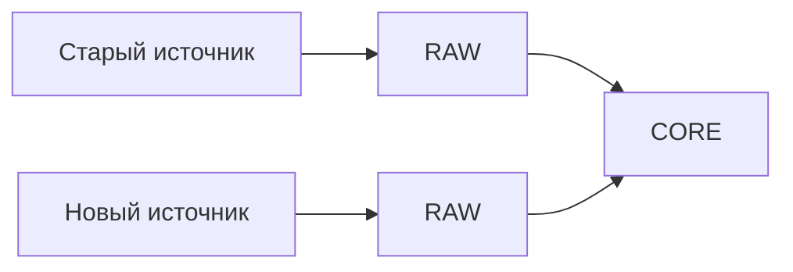

[Главная](../README.md) · [Документация](README.md)

# Стандарт подключения новых наборов данных

## 1. Термины

**Источник (`source`)** — логический источник сведений и область его ответственности.

**Набор данных (`dataset`)** — структурированный набор внутри источника с определенными смыслом и зернистостью.

**Транспорт (`transport`)** — способ доставки набора данных. Excel, CSV, API, папка, URL или сетевой путь описывают форму или способ получения данных и сами по себе не определяют новую предметную идентичность.

**Файловый артефакт (`file artifact`)** — физический файл, связанный с конкретным `load` и сохраняющий исходную форму поставки.

**Реестр** — пользовательское название исходного набора. В технической модели он оформляется как `dataset`.

Один источник может предоставлять несколько наборов данных.

Имена технических объектов и полей определяются [стандартом именования](naming-convention.md).

## 2. Общий порядок

Новый набор подключается к существующему конвейеру:

```text
META → RAW → STG → XREF → CORE
```

`xref` используется, если требуется сопоставление внешней идентичности. `ops`, `api` и `mart` добавляются только при наличии рабочей или аналитической задачи.

## 3. Обследование набора

До создания таблиц фиксируются:

- назначение набора;
- источник и владелец;
- периодичность получения;
- зернистость;
- ключевые поля;
- внешние идентификаторы;
- связи с существующей моделью `core`.

Формулировка зернистости должна описывать смысл строки, а не формат файла.

Перед проектированием новой сущности проверяется, нет ли такой сущности или факта в `core` уже. Новый источник не создает собственные версии общих объектов.

## 4. Входной контракт

Для набора задается ожидаемая структура: имя поля, смысл, тип, обязательность, допустимость `NULL`, формат и роль в идентификации.

Для файлового транспорта контракт также определяет требования к сохранению физического оригинала поставки.

Контракт также определяет зернистость входной записи, способ ее идентификации и распознавания исправлений, тип поставки — снимок (`snapshot`) или изменения (`delta`), область полноты, смысл отсутствующей записи, порядок применения поступлений и единицу атомарной публикации.

Пример:

| Поле | Тип | Обязательное | Назначение |
|---|---|---:|---|
| `external_id` | text | да | идентификатор записи источника |
| `operation_date` | date | да | дата операции |
| `asset_code` | text | да | внешний идентификатор объекта |
| `quantity` | numeric | нет | количество |

Подготовка на стороне источника ограничивается техническими действиями: выбором нужных таблиц, приведением заголовков, удалением служебных строк и формированием стабильного набора колонок. Каноническая бизнес-логика остается на стороне PostgreSQL.

## 5. Загрузка и обработка

| Этап | Результат |
|---|---|
| META | источник, набор и загрузка зарегистрированы |
| RAW | данные сохранены с происхождением |
| STG | типы и технические форматы приведены |
| XREF | внешние ключи источников сопоставлены с внутренними ID |
| CORE | новые сущности и факты включены в общую модель |

Файлы одного поступления связываются с тем же `load`, что и соответствующие записи `raw`.

Для сохраняемого файлового артефакта фиксируются технические метаданные, достаточные для его поиска, проверки целостности и трассировки происхождения. Конкретный состав полей определяется реализацией.

Каждая запись `raw` имеет устойчивый адрес в пределах загрузки и однозначно связана с `load`, `dataset` и `source`. Пара `(load_id, source_row_number)` используется, только если ее достаточно для различения всех записей загрузки. При нескольких файлах, листах, коллекциях или других вложенных структурах локатор расширяется необходимыми компонентами, включая при необходимости идентификатор или иной устойчивый локатор файлового артефакта.

Результат включения в `core` связан с использованными записями `raw` и обработкой, сформировавшей результат. Одна входная запись может дать несколько результатов; один результат может использовать несколько входных записей. Одного поля последней загрузки (`last_load_id`) у канонического объекта недостаточно для сохранения этой цепочки.

Получение входа и его повторная обработка различаются. Каждая обработка связана с использованным входом и примененной версией правил. Сведения, идентифицирующие обработку и ее исход, относятся к `meta`; выполнение обработки — к `etl`. Если решение о сопоставлении, выборе значения или исправлении нельзя восстановить из `raw` и правил, сохраняется его основание.

Физическая форма связей происхождения определяется для конкретной типизированной предметной модели. Постоянное хранение промежуточных результатов `stg` не требуется.

Разные источники не объединяются в одной RAW-таблице только из-за похожей структуры.

## 6. Включение в CORE

Набор данных может добавлять экземпляры существующих сущностей и новые факты существующей модели. Новая таблица `core` создается только при появлении нового типа сущности или факта и должна соответствовать [стандарту моделирования данных](data-modeling-standard.md).

`xref` определяет, какому объекту соответствуют сведения. Канонические значения сущности или группы атрибутов выбираются по явному серверному правилу: авторитетный источник, приоритет или версия источника. Для разных групп атрибутов правила и источники могут различаться; при единственном источнике достаточно правила приема значений только из него. Если конфликт не разрешается, он остается диагностируемым и не устраняется порядком запуска ETL.

Исправление результата проверки в `ops` не исправляет автоматически факт `core`. Если API допускает правку предметных данных, происхождение и основание изменения сохраняются. Контракт определяет взаимодействие корректировки с последующими поставками: источник не затирает ее, если это не разрешено правилами.

Если данные участвуют в рабочем процессе, состояние процесса хранится в `ops`. Если нужен рабочий интерфейс, добавляется операция `api`. Для аналитики расширяется `mart` с переиспользованием существующих измерений.

## 7. Контроль загрузки

При приемке проверяются:

- количество строк;
- обязательные поля и типы;
- заявленная уникальность;
- результат сопоставления через `xref`;
- потери строк между этапами;
- соответствие итоговой зернистости;
- наличие и целостность файлового артефакта, если его сохранение предусмотрено входным контрактом.

Для каждого входного наблюдения доступен объяснимый результат: принято, подтверждено как повтор, отклонено или ожидает обработки либо сопоставления. Причина отклонения или ожидания должна быть диагностируемой; физические названия статусов определяются реализацией. При неразрешенной обязательной ссылке запись сохраняется для повторной обработки, а фиктивный объект ради внешнего ключа не создается. Контроль потерь учитывает преобразование зернистости между этапами.

Повтор одного и того же входа при тех же правилах и сопоставлениях не создает дополнительного бизнес-эффекта в `core`. Техническая история попыток обработки при этом может сохраняться. Конкретный способ повторной обработки задается контрактом набора.

Контрольная сумма содержимого может использоваться для проверки неизменности и обнаружения идентичного физического файла. Решение о регистрации нового `load` определяется контрактом набора и смыслом поступления.

Отсутствие записи означает удаление или прекращение действия только для полного `snapshot` соответствующей области и при явно установленном в контракте правиле. Отсутствие записи в `delta` ничего не говорит об удалении объекта. Время загрузки само по себе не определяет приоритет сведений.

## 8. Замена и отключение источника

При замене источника или транспорта меняются затронутые интеграционные слои — `meta`, `raw`, `stg` и при необходимости `xref`. Изменение файлового пути, сетевой папки или другого физического транспорта сохраняет идентичность `source` и `dataset`, если смысл набора и пространство внешних ключей остаются прежними.

Изменение структуры или формата отражается во входном контракте. Ранее полученные загрузки сохраняют свою идентичность и происхождение.

Если предметный смысл не изменился, `core` сохраняется.



Отключение источника не удаляет автоматически его исторические загрузки. Состояние источника меняется в `meta`, происхождение уже принятых данных сохраняется.

## 9. Приемочные условия

Интеграция считается готовой, когда:

- смысл и зернистость набора определены;
- источник и набор зарегистрированы;
- входной контракт зафиксирован;
- для файловой поставки зафиксирована связь между `load` и файловым артефактом, если сохранение оригинала предусмотрено входным контрактом;
- `raw` сохраняет данные и происхождение;
- `stg` выполняет только техническую подготовку;
- внешние идентификаторы разрешены там, где это требуется;
- существующие сущности `core` переиспользованы;
- повторная загрузка контролируется;
- рабочее состояние, API и аналитика добавлены только по необходимости.

Интеграция использует общий архитектурный конвейер, существующую модель `core` и метаданные `meta`. Структура файловых каталогов выполняет только функцию физической организации хранения.
