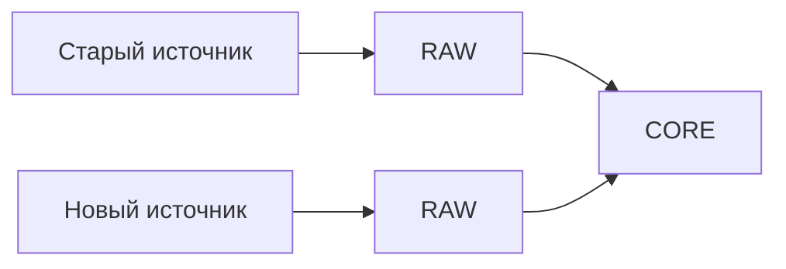

[Главная](../README.md) · [Документация](README.md)

# Стандарт подключения новых наборов данных

## 1. Термины

**Источник (`source`)** — система или место, откуда поступают данные.

**Набор данных (`dataset`)** — конкретный структурированный набор внутри источника.

**Реестр** — пользовательское название исходного набора. В технической модели он оформляется как `dataset`.

Один источник может предоставлять несколько наборов данных.

## 2. Общий порядок

Новый набор подключается к существующему конвейеру:

```text
META → RAW → STG → XREF → CORE
```

`xref` используется, если требуется сопоставление внешней идентичности. `ops`, `api` и `mart` добавляются только при наличии рабочей или аналитической задачи.

## 3. Обследование набора

До создания таблиц фиксируются:

- назначение набора;
- источник и владелец;
- периодичность получения;
- зернистость;
- ключевые поля;
- внешние идентификаторы;
- связи с существующей моделью `core`.

Формулировка зернистости должна описывать смысл строки, а не формат файла.

Перед проектированием новой сущности проверяется, нет ли такой сущности или факта в `core` уже. Новый источник не создает собственные версии общих объектов.

## 4. Входной контракт

Для набора задается ожидаемая структура: имя поля, смысл, тип, обязательность, допустимость `NULL`, формат и роль в идентификации.

Пример:

| Поле | Тип | Обязательное | Назначение |
|---|---|---:|---|
| `external_id` | text | да | идентификатор записи источника |
| `operation_date` | date | да | дата операции |
| `asset_code` | text | да | внешний идентификатор объекта |
| `quantity` | numeric | нет | количество |

Подготовка на стороне источника ограничивается техническими действиями: выбором нужных таблиц, приведением заголовков, удалением служебных строк и формированием стабильного набора колонок. Каноническая бизнес-логика остается на стороне PostgreSQL.

## 5. Загрузка и обработка

| Этап | Результат |
|---|---|
| META | источник, набор и загрузка зарегистрированы |
| RAW | данные сохранены с происхождением |
| STG | типы и технические форматы приведены |
| XREF | внешние ключи сопоставлены с внутренними ID |
| CORE | новые сущности и факты включены в общую модель |

Каждая запись `raw` имеет устойчивый адрес в пределах загрузки и однозначно связана с `load`, `dataset` и `source`. Пара `(load_id, source_row_no)` используется, только если ее достаточно для различения всех записей загрузки. При нескольких файлах, листах, коллекциях или других вложенных структурах локатор расширяется необходимыми компонентами.

Результат включения в `core` связан с использованными записями `raw` и обработкой, сформировавшей результат. Одна входная запись может дать несколько результатов; один результат может использовать несколько входных записей. Одного поля последней загрузки (`last_load_id`) у канонического объекта недостаточно для сохранения этой цепочки.

Получение входа и его повторная обработка различаются. Каждая обработка связана с использованным входом и примененной версией правил. Если решение о сопоставлении, выборе значения или исправлении нельзя восстановить из `raw` и правил, сохраняется его основание.

Физическая форма связей происхождения определяется для конкретной типизированной предметной модели. Постоянное хранение промежуточных результатов `stg` не требуется.

Разные источники не объединяются в одной RAW-таблице только из-за похожей структуры.

## 6. Включение в CORE

После `stg` и `xref` возможны три результата:

1. добавлены новые экземпляры уже существующей сущности;
2. добавлены новые факты существующей модели;
3. действительно требуется новая сущность или новый тип факта.

Новая таблица `core` создается только в третьем случае и должна соответствовать `data-modeling-standard.md`.

Если данные участвуют в рабочем процессе, состояние процесса хранится в `ops`. Если нужен рабочий интерфейс, добавляется операция `api`. Для аналитики расширяется `mart` с переиспользованием существующих измерений.

## 7. Контроль загрузки

При приемке проверяются:

- количество строк;
- обязательные поля и типы;
- заявленная уникальность;
- результат сопоставления через `xref`;
- потери строк между этапами;
- соответствие итоговой зернистости.

Строка, не прошедшая обработку, должна иметь диагностируемую причину. Бесшумное отбрасывание данных недопустимо.

Повторная загрузка одного набора не должна создавать неконтролируемые дубли. Конкретное правило повторной обработки зависит от природы набора и фиксируется в его контракте.

## 8. Замена и отключение источника

При замене Excel на API или другой смене способа получения данных меняются интеграционные слои — `meta`, `raw`, `stg` и при необходимости `xref`.

Если предметный смысл не изменился, `core` сохраняется.



Отключение источника не удаляет автоматически его исторические загрузки. Состояние источника меняется в `meta`, происхождение уже принятых данных сохраняется.

## 9. Приемочные условия

Интеграция считается готовой, когда:

- смысл и зернистость набора определены;
- источник и набор зарегистрированы;
- входной контракт зафиксирован;
- `raw` сохраняет данные и происхождение;
- `stg` выполняет только техническую подготовку;
- внешние идентификаторы разрешены там, где это требуется;
- существующие сущности `core` переиспользованы;
- повторная загрузка контролируется;
- рабочее состояние, API и аналитика добавлены только по необходимости.

Не допускаются отдельные архитектурные конвейеры под конкретный файл, `core`-таблицы по имени Excel-реестра и связи общих сущностей только по отображаемым названиям.
