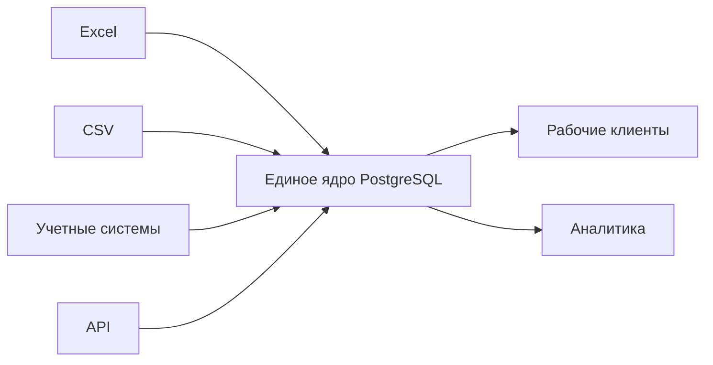

[Главная](../README.md) · [Документация](README.md)

# Видение и границы проекта

## 1. Контекст

Проект рассчитан на среду, где структурированные данные накапливаются в Excel-книгах, CSV, локальных реестрах, выгрузках учетных систем и сетевых папках. Пока каждый файл решает отдельную задачу, такая схема работает. Проблемы начинаются, когда одни и те же данные используют несколько процессов.

В этот момент появляются параллельные версии одних сущностей, ручные связи между реестрами, разные трактовки одинаковых показателей и зависимость от конкретных файлов. Чем больше таких источников, тем дороже поддерживать согласованность.

Ядро вводится не вместо Excel, а вместо разрозненного хранения общей истины.

## 2. Цель

PostgreSQL становится центром структурированных данных. Источники поставляют сведения в ядро, рабочие приложения используют его через API, аналитические инструменты получают подготовленные витрины.

Смена источника или клиентского приложения не должна требовать перестройки общей модели данных, если смысл данных не изменился.

## 3. Роли компонентов

**PostgreSQL** хранит полученные данные, канонические сущности и факты, рабочее состояние, серверную логику и аналитические витрины.

**Excel и другие рабочие приложения** остаются пользовательскими инструментами. Они могут вводить данные, показывать очереди, принимать решения пользователя и получать результаты из ядра.

**Power Query, Power Pivot и BI** используются как аналитические клиенты поверх подготовленного слоя `mart`.

**Файловая система** остается местом для документов, изображений, архивов и других объектов, для которых файл является естественной формой хранения. При необходимости PostgreSQL хранит их метаданные и связи с сущностями ядра.

## 4. Что входит в проект

В границы проекта входят:

- логическая архитектура PostgreSQL;
- правила моделирования сущностей, фактов и связей;
- прием и техническая подготовка данных источников;
- сопоставление внешних идентификаторов;
- хранение рабочего состояния;
- стабильный интерфейс для рабочих клиентов;
- аналитический слой;
- SQL-миграции и базовые правила эксплуатации.

Проект не задает конкретный бизнес-процесс, интерфейс рабочего места или BI-платформу. Он также не является ERP, CRM, системой документооборота, файловым хранилищем или универсальным low-code конструктором.

## 5. Границы модели

Не каждый файл должен стать таблицей PostgreSQL. Сначала определяется, какие сущности и факты он содержит и существуют ли они уже в `core`.

Не все данные необходимо переносить в ядро. Централизация оправдана для структурированных данных, которые используются несколькими процессами, связываются с другими наборами, участвуют в аналитике или требуют общего рабочего состояния.

Единое ядро не означает одну универсальную таблицу. Общими становятся идентичность сущностей, правила связей и место хранения состояния.

## 6. Устойчивые границы

Источник отвечает за предоставление данных. Ядро отвечает за их нормальное представление и связи. Рабочий клиент использует `api`, аналитический — `mart`.

Рост объема данных может потребовать новых индексов, более мощного сервера или другой схемы резервного копирования. Эти изменения относятся к эксплуатации и не должны менять логическую модель ядра.

## 7. Критерии результата

Архитектура считается работающей по назначению, если:

1. общие структурированные данные имеют одно центральное состояние;
2. одинаковые сущности из разных источников связываются через внутреннюю идентичность;
3. происхождение данных можно проследить до источника и загрузки;
4. новый набор данных подключается к существующему конвейеру, а не создает собственный;
5. общая бизнес-логика выполняется централизованно;
6. рабочие клиенты не хранят независимые версии общего состояния;
7. перекрестная аналитика строится через общие сущности, а не через повторное ручное объединение файлов;
8. структура базы воспроизводится из репозитория.
